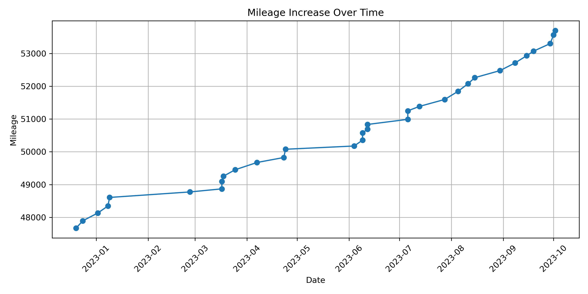
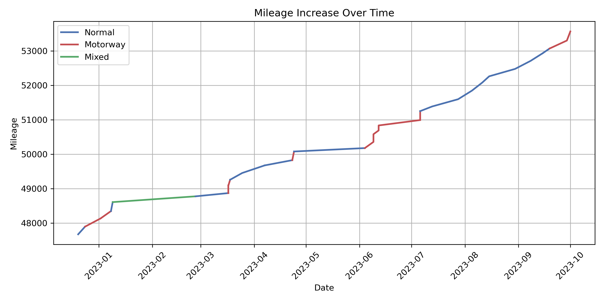
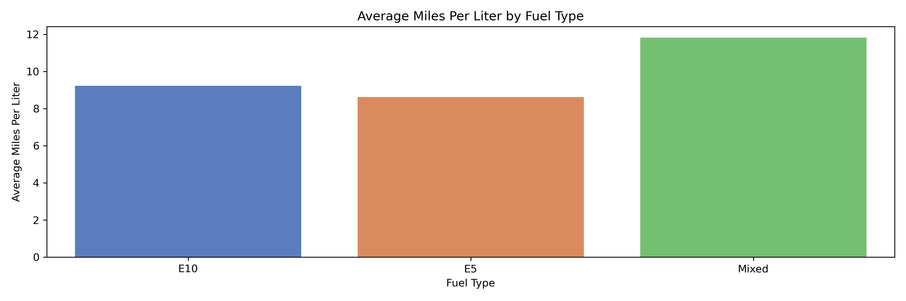
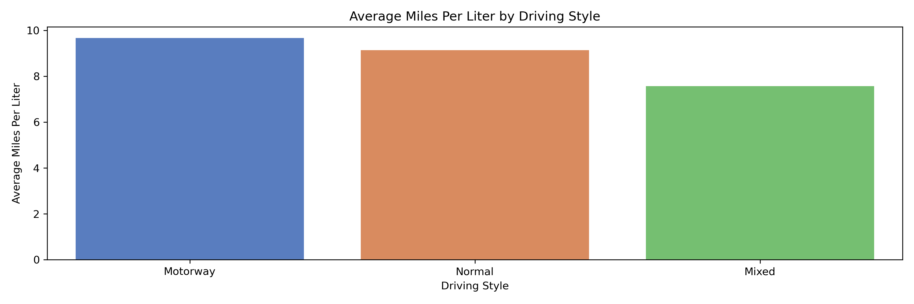

# Car Fuel Efficiency Analysis

This repository contains a very small dataset `fuel.csv` which I created myself by recording each time I put fuel in my car and noting the car mileage, liters put in and cost along with other variables. It has basic analysis of the data and a utility script for calculating an estimate of teh cost of a trip.

- The notebook `car-fuel.ipynb` contains a basic analysis of the data.
- The python file `journey_cost.py` can be used to calculate the cost of a journey, with the option to filter by several factors such as driving style to compute the MPL rate.
- `data_processing.py` runs the data cleaning and saves out updated versions of `fuel_mpl.csv` and `fuel_processed.csv`. This is referenced in `journey_cost.py` so that the newest data is used.

The dataset will be periodically updatedfor as long as I continue to keep records.

_Note: I plan to add a report summarising the differences in fuel efficiency from different driving styles, when the roof racks are on/off and what fuel type was used, but I am waiting for more data._

## Graphs Produced

### Mileage

### Fuel Prices

_Note: most dependant on area and whether I was on a motorway specifically. There is a non-motorway spike from putting in Supreme fuel._

### Fuel Efficiency

